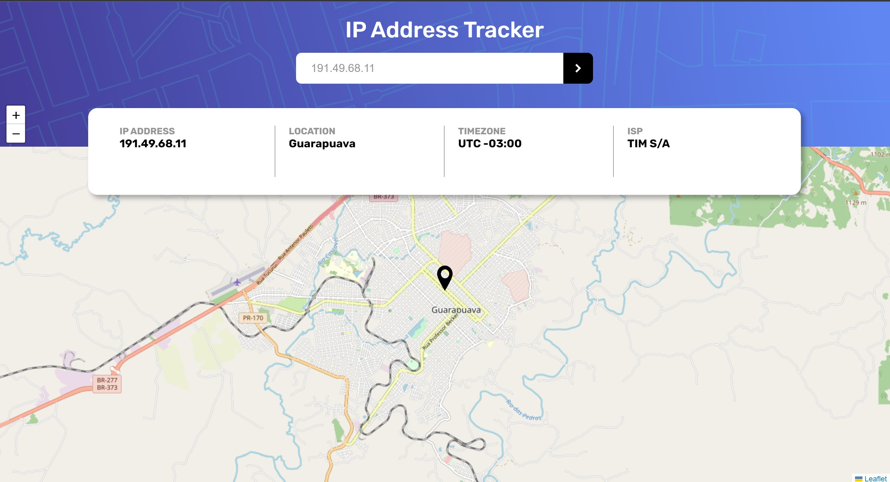

# IP tracjer
Frontend mentor challenge.
## Description

Created this challenge using Next.js. It is simple one paged app that lets you find rough location of IP address that you searched for.
To create this application I needed to use Leafletjs and ipify. Style is based on the mockup on frontend mentor pages.

## Usage

Type IP address in search textarea and search.

## Screenshot
Here is preview of my work.

## Links
[HERE](https://roaring-daffodil-848226.netlify.app/) you can find my deployed pages.
[HERE](https://www.frontendmentor.io/profile/FrantiskaAli) is my frontend mentor profile.

## Credits
Created by [FranAli](https://github.com/FrantiskaAli/).

